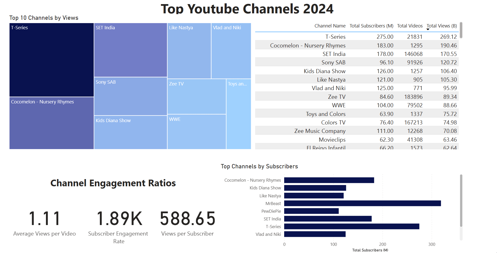
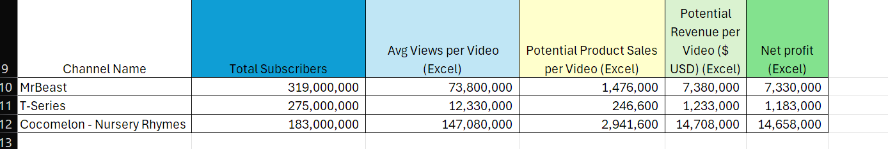
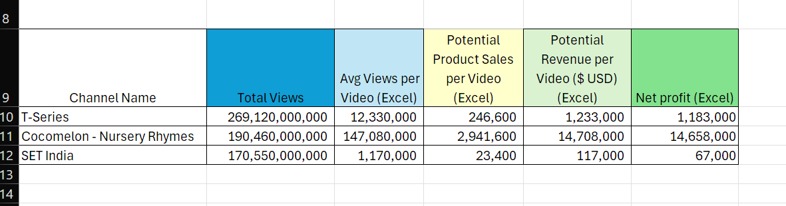

# Data Portfolio - Power BI and Excel Project

# Top Youtuber Collaboration Analysis


#Table of Contents
- [Objective](#objective)
- [Data Source](#data-source)
- [Tools](#tools)
- [Data Exploration](#data-exploration)
- [Data Cleaning](#data-cleaning)
- [Data Testing](#data-testing)
- [Visualization](#visualization)
- [Analysis](#analysis)


# Objective

-Goal
The business is interested in a marketing collaboration with popular youtubers. They want to know which ones would be ideal partners for the marketing promotion to sell a product. 

-Plan
To design and create an analytics dashboard that will display data on popular youtubers. 
The main stats included will be:
-Subscribers

-Views

-Videos Count

-Subscriber Engagement

We believe that channels with high view counts will correlate with producing high profits.

# Data Source
The data is sourced publicly from Kaggle. 
What I used is a list of the [Top 100 Youtubers](https://www.kaggle.com/datasets/ytrank/top-100-youtube-channels-updated-weekly) that is updated monthly.

# Tools
The software used for this project.

| Tool | Use |
| --- | --- |
| SQL Server | For cleaning and testing the data |
| Excel | For exploring the data |
| Power BI | For creating the visual dashboard |

# Data Exploration

1. The data contains channel info and metrics on each creator's videos and subscribers.
2. For this project we only need 4 main columns. The channel_name, subscriber_count, view_count, and video_count. Will include category and country for extra information.
3. The unneeded columns will be removed. 

# Data Cleaning

Will extract and change data by putting them into a view.

## Create View
```sql

/*

1. Remove unneccsary columns by only selecting the oens we need.
2. Replace NULL values.
3. Rename the column names as needed.

--ISNULL
--Find and replace NULL values.
*/

CREATE VIEW view_top_youtubers_2024 AS

SELECT
	CAST (title AS NVARCHAR(100)) AS channel_name,
	subscriber_count AS total_subscribers,
	view_count AS total_views,
	video_count AS total_videos,
	ISNULL (category, 'Other') AS category,
	ISNULL (country, 'N/A') AS country
FROM top_youtubers_2024;
```

# Data Testing

Perform basic quality and validation checks.

## Row Count

```sql

--1. Row count check

SELECT COUNT(*) AS row_count
FROM view_top_youtubers_2024
```


## Column Count

```sql

--2. Column count test

SELECT 
		COUNT(*) AS colmun_count 
FROM 
	INFORMATION_SCHEMA.COLUMNS
WHERE 
	TABLE_NAME = 'view_top_youtubers_2024'

```


## Data type test

```sql

--3 Data type test

SELECT 
	COLUMN_NAME,
	DATA_TYPE
FROM 
	INFORMATION_SCHEMA.COLUMNS
WHERE 
	TABLE_NAME = 'view_top_youtubers_2024'
	
```

	

## Duplicate test

```sql

--4. Duplicate check

SELECT channel_name,
		COUNT(*) AS duplicate_count
FROM view_top_youtubers_2024
GROUP BY channel_name
HAVING	COUNT(*) > 1

```


# Visualization 

Next is to load the created view into Power BI and create our dashboard. 

## Dax Measures

We will create formulas so we can display the values. Some will be configured to show per each million.

### Avergage Views per Video

```sql

Average Views per Video = 
VAR million = 1000000
VAR sumofTotalViews = SUM(view_top_youtubers_2024[total_views])
VAR totalVideos = SUM(view_top_youtubers_2024[total_videos])
VAR AverageViews = DIVIDE(DIVIDE(sumofTotalViews, totalVideos), million, BLANK())

RETURN AverageViews

```

### Total Subscribers

```sql

Total Subscribers (M) = 
VAR million = 1000000
VAR sumofSubscribers = SUM(view_top_youtubers_2024[total_subscribers])
VAR totalSubscribers = DIVIDE(sumofSubscribers, million)

RETURN totalSubscribers

```
### Total Videos

```sql

Total Videos = 
VAR totalVideos = SUM(view_top_youtubers_2024[total_videos])

RETURN totalVideos

```

### Total Views

```sql

Total Views (B) = 
VAR billion = 1000000000
VAR sumofTotalViews = SUM(view_top_youtubers_2024[total_views])
VAR totalViews = DIVIDE(sumofTotalViews, billion)

RETURN totalViews

```

### Views per Subscribers

```sql

Views per Subscriber = 
VAR sumofTotalViews = SUM(view_top_youtubers_2024[total_views])
VAR sumofTotalSubscribers = SUM(view_top_youtubers_2024[total_subscribers])
VAR viewsPerSubscriber = DIVIDE(sumofTotalViews, sumofTotalSubscribers, BLANK())

RETURN viewsPerSubscriber

```

### Subscriber Engagement Rate

This is a made up formula for the sake of testing.

```sql

Subscriber Engagement Rate = 
VAR sumofTotalSubscribers = SUM(view_top_youtubers_2024[total_subscribers])
VAR sumofTotalVideos = SUM(view_top_youtubers_2024[total_videos])
VAR subscriberEngRate = DIVIDE(sumofTotalSubscribers, sumofTotalVideos, BLANK())

RETURN subscriberEngRate

```

## Completed Visual 



[Interactive Visual](https://app.powerbi.com/view?r=eyJrIjoiZjE4NjFhNWMtZGViOS00MjYzLWE2MzMtZTBmNGU0OTZlYTkwIiwidCI6IjRiZjk1MzI5LTBiMzAtNGY5Yi1iMmUxLWFmNjgyYWVhZDViYyIsImMiOjJ9)

# Analysis

We are going to examine the top 3 from the following metrics:
1. Most Subscribers
2. Most Views
Using Excel, we will calculate how much revenue could be made by colloborating with these creators. 

## Formulas
Conversation Rate - 2$ - Assuming 2 percent of views purchase the advertised product.
Product Cost - $5 - Price to purchase
Campaign Cost - $50,000 - How much we will pay collaborators.

Product Sales = AverageViews x Conversion Rate
Revenue per Video = Product Sales x Product Cost
Net Profit = Revenue - Campaign Cost


## Most Subscribers

| Channel Name | Total Subscribers | Average Views per Video | Potential Sales | Potential Revenue | Net Profit
| --- | --- | --- | --- | --- | --- |
| MrBeast |  319,000,000 |  73,800,000 |  1,476,000 |  7,380,000 |  7,330,000 
| T-Series |  275,000,000 |  12,330,000 |  246,600 |  1,233,000 |  1,183,000 
| Cocomelon - Nursery Rhymes |  183,000,000 |  147,080,000 |  2,941,600 |  14,708,000 |  14,658,000 



All three channels have a good average number of views. Despite having significantly less subscribers, Cocomelon has twice the average views of MrBeast over 10 times that of T-Series. Each channel could potentially make a large profit in the millions given their viewership. Cocomelon reaches as high as $14 million and could be considered for a larger collaboration.

## Most Views

| Channel Name | Most Views | Average Views per Video | Potential Sales | Potential Revenue | Net Profit
| --- | --- |
| T-Series |  269,120,000,000 |  12,330,000 |  246,600 |  1,233,000 | 1,183,000
| Cocomelon - Nursery Rhymes |  190,460,000,000 |  147,080,000 |  2,941,600 |  14,708,000 | 14,658,000
| SET India |  170,550,000,000 | 1,170,000 |  23,400 |  117,000 | 67,000



The top 3 channels have total views in the hundred millions. T-Series and Cocomelon appear again with a high number of average views. Set India makes a profit if worked,, but a smaller promotion might to more revenue.

# Findings

Channels with a high number of average views per video are more likely to produce a profit. Cocomelon shows to have the highest potential profits if a collaboration is formed. MrBeast is on the the high end with T-Series and Set India being on the middle to low ends. Cocomelon's potential is high enough that an even larger promotion could be considered. Smaller promotions should be researched for channels with lower average views. 
