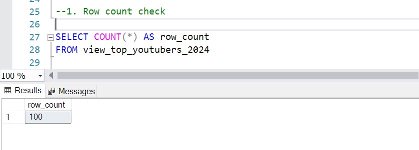
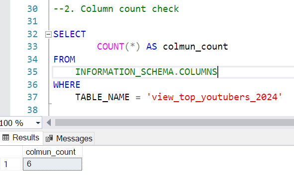
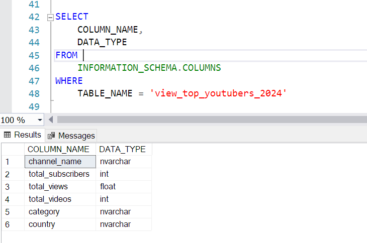
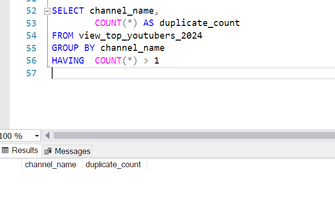

# Data Portfolio - Power BI and Excel Project

# Top Youtuber Collaboration Analysis


#Table of Contents
- [Objective](#objective)
- [Data Source](#data-source)
- [Tools](#tools)
- [Design](#design)
- [Data Exploration](#data-exploration)
- [Data Cleaning](data-cleaning)


# Objective

-Goal
The business is interested in a marketing collaboration with popular youtubers. They want to know which ones would be ideal partners for the marketing promotion.

-Plan
To design and create an analytics dashboard that will display data on popular youtubers. 
The main stats included will be:
-Subscribers
-Views
-Videos Count
-Subscriber Engagement

# Data Source
The data is sourced publicly from Kaggle. 
What I used is a list of the [Top 100 Youtubers](https://www.kaggle.com/datasets/ytrank/top-100-youtube-channels-updated-weekly) that is updated monthly.

# Tools
The software used for this project.

| Tool | Use |
| --- | --- |
| SQL Server | For cleaning and testing the data |
| Excel | For exploring the data |
| Power BI | For creating the visual dashboard |

# Data Exploration

1. The data contains channel info and metrics on each creator's videos and subscribers.
2. For this project we only need 4 main columns. The channel_name, subscriber_count, view_count, and video_count. Will include category and country for extra information.
3. The unneeded columns will be removed. 

# Data Cleaning

Will extract and change data by putting them into a view.

## Create View
```sql

/*

1. Remove unneccsary columns by only selecting the oens we need.
2. Replace NULL values.
3. Rename the column names as needed.

--ISNULL
--Find and replace NULL values.
*/

CREATE VIEW view_top_youtubers_2024 AS

SELECT
	CAST (title AS NVARCHAR(100)) AS channel_name,
	subscriber_count AS total_subscribers,
	view_count AS total_views,
	video_count AS total_videos,
	ISNULL (category, 'Other') AS category,
	ISNULL (country, 'N/A') AS country
FROM top_youtubers_2024;
```

# Data Testing

Perform basic quality and validation checks.

## Row Count

```sql

--1. Row count check

SELECT COUNT(*) AS row_count
FROM view_top_youtubers_2024
```



## Column Count

```sql

--2. Column count test

SELECT 
		COUNT(*) AS colmun_count 
FROM 
	INFORMATION_SCHEMA.COLUMNS
WHERE 
	TABLE_NAME = 'view_top_youtubers_2024'

```



## Data type test

```sql

--3 Data type test

SELECT 
	COLUMN_NAME,
	DATA_TYPE
FROM 
	INFORMATION_SCHEMA.COLUMNS
WHERE 
	TABLE_NAME = 'view_top_youtubers_2024'
	
```

	

## Duplicate test

```sql

--4. Duplicate check

SELECT channel_name,
		COUNT(*) AS duplicate_count
FROM view_top_youtubers_2024
GROUP BY channel_name
HAVING	COUNT(*) > 1

```


